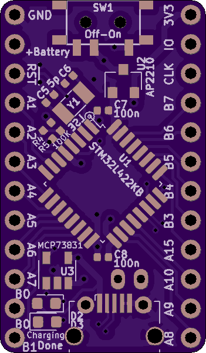
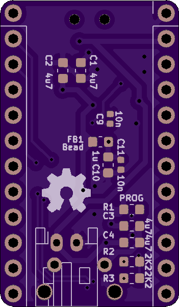

# LiPo Battery-Powered STM32 Board

This is a small board which incorporates an `MCP73831` Lithium battery charger. It has a maximum charge rate of 500mA, but it is simple and easy to use. A JST PH-2 connector is used for the battery; it seems like small lithium batteries have more or less standardized on this type of connector, but double-check the polarity before you plug anything in.

A micro-USB plug is used as a 5V supply to charge the battery, and a small slide switch is used to turn the board's power on or off. Two 100KΩ resistors also form a voltage divider for the microcontroller to read the battery voltage through pin A0's ADC channel, and I'm planning to add an example firmware which reads and prints the battery voltage over UART in the near future.

This board will not work with the almost-identical `MCP73832` chip - the difference is that the 'status' pin has a tri-state output on the `MCP73831` and an open-drain output on the `MCP73832`. So with the former, you can have separate 'charging in progress' and 'done charging' LEDS. But with the latter, you can only have one 'done charging' LED directly connected to the pin. I dunno, maybe that saves you $.005 per unit when you order 10 million at a time or something.

# Board Renders

As seen through OSHPark's purple-colored glasses:

# Safety

**Before assembling this board or trying to incorporate elements into your design, spend some time ressearching lithium battery safety precautions. Always independently verify lithium battery circuits before assembling them. Never leave lithium batteries unattended when they are charging or in use.**

Here's a link to the datasheet for the battery-charging chip. Double-check your designs against its recommendations:

http://ww1.microchip.com/downloads/en/DeviceDoc/20001984g.pdf

I'm not even going to try to make a comprehensive list of safety precautions to take when handling lithium batteries, and working with circuitry that interacts with them is even more dangerous. Do your own research on how to work with them safely, start out with small batteries in the 100s of milliAmp-hours, and most importantly, don't blame me if anything goes wrong. The MIT license is very permissive, but it also says there's no warranty :)

# Future Work

* I should use a voltage regulator with a 'power good' pin and connect it to the reset line, to reduce problems with power supply glitches when the battery gets low.

* I haven't tested the USB data lines, and if they do work, there isn't much space to add the optional-but-recommended TVS diodes such as an `SP0503BAHT`. It might be better to use a cheaper microcontroller and only use the USB port for power.

* There's no "heartbeat" LED, and it's nice to have at least one user-controlled LED on a board for all kinds of reasons. For one thing, there's no way for the board to indicate that it has a low battery.

* I need to polish a simple test firmware which reads the battery voltage and prints it out over UART every few seconds.

* It's usually silly to use a linear voltage regulator in a simple battery-powered application, because you waste a bunch of power. Using a buck converter would be a better choice here.

* Per [#1](https://github.com/WRansohoff/STM32_LiPo_Example/issues/1), I should connect the `MCP73831` ground pin to a larger ground plane to help it dissipate heat and maybe reach its maximum charge current of 500mA.

* It might be a good idea to move the 'Ground' and '+Battery' breadboard pins farther apart, to make accidental shorts less likely.
